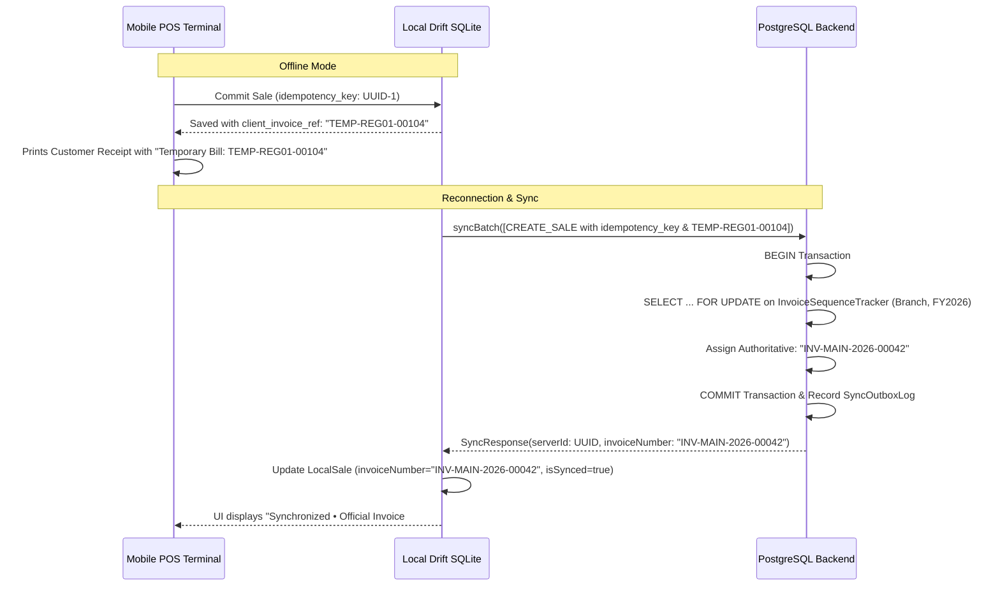

# Offline-First Architecture & Synchronization Engine

## 1. Architectural Philosophy

For frontline commercial businesses (retailers, cashiers, field salespeople, warehouse staff), network instability or outages must NEVER prevent ringing up a sale, adding a customer, or moving inventory.

The `business-app` client operates with a local Drift (SQLite) database as its immediate data store.

### Invariants:
1. **Never block user interaction on network requests.**
2. **Local writes are instantaneous and transactional.**
3. **Every local mutation is recorded into a persistent `SyncOutbox` queue.**
4. **Mutations carry client-generated Idempotency Keys (`UUIDv4`).**
5. **No offline data is ever discarded silently.**

---

## 2. Unidirectional Data Flow

### Read Flow
```text
UI Component
     │
     ▼
  BLoC/Cubit
     │
     ▼
  UseCase
     │
     ▼
 Repository
     │
     ▼
 Drift Local DB ───► Emits local data immediately to UI (Stream / Future)
     │
     ▼ (Background trigger)
 GraphQL Remote API
     │
     ▼
 Drift Local DB ───► Upserts fresh remote rows; UI updates automatically via reactive Stream
```

### Write Flow
```text
 User Action in UI (e.g., Complete Sale)
     │
     ▼
 BLoC/Cubit
     │
     ▼
 UseCase (Validation)
     │
     ▼
 Repository
     │
     ├── 1. Generates local temporary UUID (`tmp-uuid-xxxx`)
     ├── 2. Writes record locally in Drift (status: `PENDING_SYNC`)
     ├── 3. Writes payload to `SyncOutbox` table with idempotency_key
     └── 4. Returns immediate Success to UI
     │
     ▼
 Sync Engine (Background Worker / Connectivity Trigger)
     │
     ├── Reads pending items from `SyncOutbox` ordered by sequence
     ├── Dispatches GraphQL Mutation with idempotency_key
     ├── Remote server applies mutation atomically or replays existing result
     ├── Remote returns authoritative server UUID (`srv-uuid-yyyy`)
     ├── Sync Engine maps `tmp-uuid-xxxx` -> `srv-uuid-yyyy` locally
     └── Marks `SyncOutbox` entry as `SYNCHRONIZED` (or records failure with exponential backoff)
```

---

## 3. Drift Local Database Entities for Synchronization

```dart
// SyncOutbox table definition in Drift
class SyncOutboxEntries extends Table {
  IntColumn get id => integer().autoIncrement()();
  TextColumn get idempotencyKey => text().withLength(min: 36, max: 128)();
  TextColumn get mutationType => text()(); // e.g., 'CREATE_SALE', 'CREATE_CUSTOMER'
  TextColumn get entityType => text()();   // e.g., 'Sale', 'Customer'
  TextColumn get localEntityId => text()();
  TextColumn get payloadJson => text()();
  IntColumn get status => intEnum<SyncStatus>()(); // pending, inFlight, completed, failed
  IntColumn get retryCount => integer().withDefault(const Constant(0))();
  IntColumn get maxRetries => integer().withDefault(const Constant(5))();
  DateTimeColumn get createdAt => dateTime()();
  DateTimeColumn get lastAttemptedAt => dateTime().nullable()();
  TextColumn get lastError => text().nullable()();
}

enum SyncStatus {
  pending,
  inFlight,
  completed,
  failedPermanently,
}
```

---

## 4. Conflict Handling & Resolution Strategy

1. **Master Data (Customers, Products, Categories)**:
   * Uses **Version Vectors / Optimistic Locking**.
   * If remote version matches client base version: update applied cleanly.
   * If remote version is greater (concurrent edit by another terminal):
     * If conflicting fields differ, the server retains the authoritative record, updates the version, and returns the unified state.
     * Non-destructive changes merge.
2. **Transactional Ledger (Sales, Invoices, Payments, Movements)**:
   * **Append-Only Invariant**: Sales and payments are immutable transactional records.
   * Offline clients issue a local temporary bill reference (`client_invoice_ref`), never an authoritative tax invoice number.
   * The server assigns the definitive, consecutive `invoice_number` atomically upon sync.
3. **Idempotency Guarantee**:
   * If the network drops *after* the server commits a mutation but *before* the client receives the HTTP response, the client retries with the same `idempotency_key`.
   * The server detects the existing `idempotency_key`, avoids duplicate insertion, and returns the cached successful payload.

---

## 5. Authoritative Sequential Invoice Numbering Protocol

### Why Clients Cannot Generate Final Invoice Numbers
In multi-device retail and wholesale environments, multiple cashiers and mobile devices operate simultaneously while offline. If devices independently incremented `INV-0001`, `INV-0002`, collision is mathematically guaranteed upon sync, resulting in duplicate invoice numbers, out-of-order timestamps, and tax compliance violations.

### Two-Stage Numbering Protocol:



1. **Stage 1: Offline Creation (Client-Side)**
   * The client assigns a `client_invoice_ref`: `TEMP-[DEVICE_ID]-[DEVICE_COUNTER]` (e.g. `TEMP-POS01-00042`).
   * The printed receipt marks the transaction with a temporary offline bill notice.
   * The mutation is queued in `SyncOutboxTable` with a cryptographic `idempotency_key`.

2. **Stage 2: Server Reconciliation & Authoritative Issuance (Backend)**
   * The backend receives the mutation inside `syncBatch`.
   * Using PostgreSQL row-level locks (`SELECT ... FOR UPDATE` on `InvoiceSequenceTracker`), the backend increments the exact sequence for the tenant, branch, and current fiscal year.
   * The backend writes the immutable `Sale` record with the legal `invoice_number` (e.g., `INV-2627-00142`) and maps it to the client's `client_mutation_id`.
   * The response returns `{ server_id, invoice_number, is_synced: true }`.
   * The client updates `LocalSalesTable` and flips `is_synced` to `true`.

